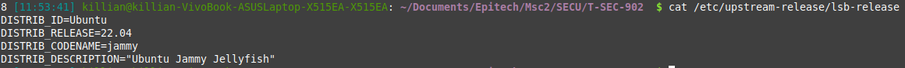
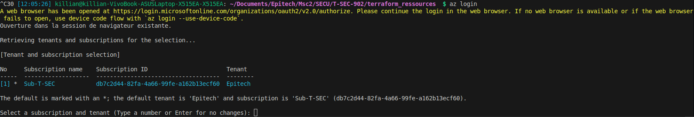

# T-SEC-902

## Set up Azure CLI

### Prérequis

### Install (Windows)

### [Install (Linux)](https://learn.microsoft.com/en-us/cli/azure/install-azure-cli-linux?pivots=apt)

For Linux mint or other distrib not listed by microsoft at the step ```Install Azure CLI``` on [How to install azure cli](https://learn.microsoft.com/en-us/cli/azure/install-azure-cli-linux?pivots=apt), you need to look the version of ur distrib:

```sh
cat /etc/upstream-release/lsb-release
```
result:



There is, ```DISTRIB_CODENAME``` varaible : jammy
And replace the ```AZ_DIST``` global variable by :

```sh
AZ_DIST=<DISTRIB_CODENAME>
```

### Configure Azure CLI

```sh
az login
```

result:


this will execute a guide into the terminal and set up your account by oauth.
after connections set up, the terminal will invite you to chose the subscription.

select by nuber the subsciption and all done for Azure CLI set-up.

## Set up Terraform Cloud Plateform

Terraform Cloud Platform will allow to store the Terraform State in order to have a cleaner working environment within a team.

### Prérequis

```
- Step Azure CLI
```

### [Install terraform (Linux)](https://developer.hashicorp.com/terraform/install?product_intent=terraform#linux)

1. Go to the [Terraform tutorial](https://developer.hashicorp.com/terraform/install)
1. Download the binary (386 for 32 bits system, ARM32/ARM64 for [ARM processors](https://assistouest.fr.processeur-arm/)).
2. Place Terraform executable file into your folder containing terraform module.

### [Install terraform (Windows)](https://developer.hashicorp.com/terraform/install?product_intent=terraform#windows)

### Configure Terraform Cloud Plateform

1. Create an account on [HCP Terraform](https://app.terraform.io/session).
2. Create an organization (retain his name <ORG_NAME>).
3. Create a work space into the organization (retain his <WORKSPACE_NAME>).
4. Go into the settings of the work space and put the execuion mode into Local (custom).
5. Create a ```backend.tf``` file to put this :

```tf
cloud {
  organization = "<ORG_NAME>"
  workspaces {
    name = "<WORKSPACE_NAME>"
  }
}
```

6. Put this into a terminal command and follow the login guide:

```sh
terraform login (Windows)
or
./terraform login (Linux)
```

7. You can now migrate the state file with.

```sh
terraform init (Windows)
or
./terraform init (Linux)
```

8. Now that Terraform has migrated the state file to HCP Terraform, delete the local state file.

```sh
rm terraform.tfstate
```